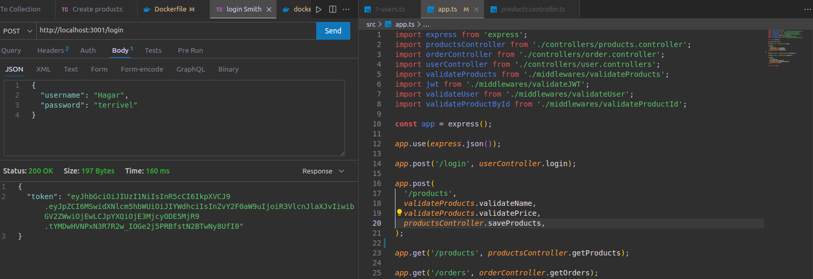

#  مشروع Trybe Smith 

## 🌐 [](https://github.com/SamuelRocha91/TrybeSmith/blob/main/README.md) [](https://github.com/SamuelRocha91/TrybeSmith/blob/main/README_es.md) [](https://github.com/SamuelRocha91/TrybeSmith/blob/main/README_en.md) [](https://github.com/SamuelRocha91/TrybeSmith/blob/main/README_ru.md) [](https://github.com/SamuelRocha91/TrybeSmith/blob/main/README_ch.md) [](https://github.com/SamuelRocha91/TrybeSmith/blob/main/README_ar.md)



## الوصف

هذا مشروع تقييم تم تطويره في وحدة خلفية دورة تطوير الويب في Trybe. شمل المشروع استخدام **Typescript** و **Sequelize** و **JWT**. خلال التطوير، تم تحسين العديد من المهارات:

- معالجة الاختبارات
- استخدام هيكل MSC (النموذج - الخدمة - التحكم)
- إنشاء طرق لإنشاء وقراءة وتحديث المعلومات
- مصادقة الطرق

كان الهدف من هذا المشروع هو إنشاء متجر للأشياء العائدة للقرون الوسطى باستخدام **Typescript** و **Sequelize**. كان التركيز الرئيسي على تطوير طبقات **Service** و **Controllers**.

## التقنيات المستخدمة

- **Node.js**
- **Express**
- **Typescript**
- **Sequelize**
- **MySQL**
- **JWT (JSON Web Token)**
- **Docker و Docker Compose**

## هيكل المشروع

تم هيكلة المشروع وفقًا لهندسة MSC، حيث يتم فصل المسؤوليات بين النموذج والخدمة ووحدة التحكم. وفيما يلي بعض الطرق الرئيسية التي تم تنفيذها:

### الطرق

- **POST /login**: تسجيل دخول المستخدم.
- **POST /products**: إضافة منتج جديد (التحقق من الاسم والسعر).
- **GET /products**: إرجاع جميع المنتجات المسجلة.
- **GET /orders**: إرجاع جميع الطلبات المسجلة.
- **POST /orders**: إنشاء طلب جديد (التحقق من JWT، ومعرف المستخدم، ومعرف المنتج).

### الوسائط

يستخدم المشروع العديد من الوسائط للتحقق، بما في ذلك:

- `validateProducts`: التحقق من بيانات المنتج (الاسم والسعر).
- `validateUser`: التحقق من بيانات المستخدم.
- `validateProductById`: التحقق من وجود المنتج بواسطة المعرف.
- `validateJWT`: التحقق من رمز JWT للمصادقة.

## تشغيل المشروع

لتشغيل المشروع، اتبع الخطوات التالية:

### المتطلبات المسبقة

- تثبيت **Docker** و **Docker Compose**.
- تثبيت **Node.js** (اختياري، إذا كنت ترغب في التشغيل محليًا دون Docker).

### خطوات التشغيل

1. استنساخ المستودع:
   ```bash
   git clone https://github.com/SamuelRocha91/TrybeSmith.git
   cd TrybeSmith
   ```

2. إنشاء ملف `.env` في جذر المشروع وإضافة متغيرات البيئة التالية:
   ```plaintext
   DB_USER=root
   DB_PASSWORD=password
   DB_HOST=db
   DB_PORT=3306
   DB_NAME=Trybesmith
   JWT_SECRET=secret
   ```

3. تشغيل Docker Compose لبناء وبدء الحاويات:
   ```bash
   docker-compose up --build
   ```

4. الوصول إلى واجهة برمجة التطبيقات في متصفحك أو أداة API (مثل Postman) على `http://localhost:3001`.

## مشاريع أخرى

- ⚽ [Typescript FootBall API](https://github.com/SamuelRocha91/trybeFutebolClube/blob/main/README_ar.md)
- 🐉 [Trybers and Dragons](https://github.com/SamuelRocha91/trybeAndDragons/blob/main/README_ar.md)
- 🌶️ [Recipes App](https://github.com/SamuelRocha91/ProjectRecipesApp/blob/main/README_ar.md)
- 🪧 [Blogs Api](https://github.com/SamuelRocha91/BlogsApi/blob/main/README_ar.md)
- 🐣 [Pokedex](https://github.com/SamuelRocha91/pokedex/blob/main/README_ar.md)
- 🏪 [FrontEnd Online Store](https://github.com/SamuelRocha91/project-frontend-online-store/blob/main/README_ar.md)
- 👛 [Expense organizer](https://github.com/SamuelRocha91/project-trybewallet/blob/main/README_ar.md)
- 🎮 [Trivia](https://github.com/SamuelRocha91/trivia_game/blob/main/README_ar.md)
